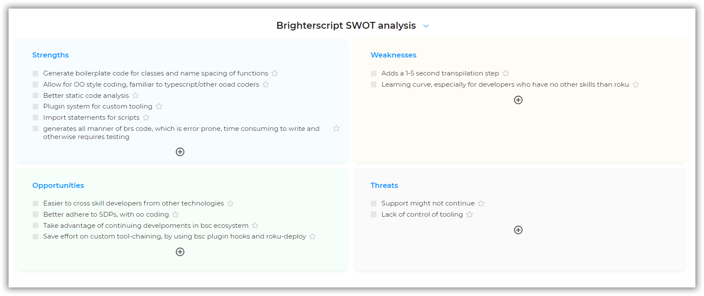
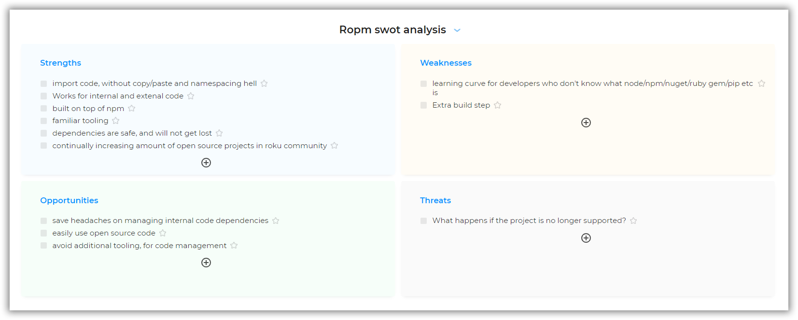
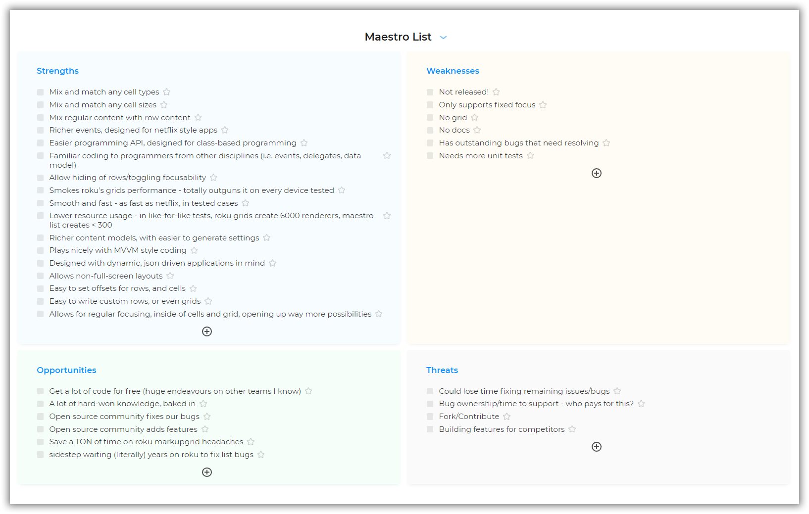

# Justifying maestro's use

There are many factors affecting the decision to adopt a technology, such as:

 - Suitability for the project
 - Alignment with resource skill-sets
 - Ease of adoption
 - Support
 - Documentation
 - Maturity
 - Control
 - Training requirements
 - Back out/Long term maintenance,
 - etc

This document aims to assist with deciding if maestro is suitable for your roku application and organization.

## Production suitability

The base view, and mvvm framework of maestro, as well as core util functionality have been used for more than 2 years, in applicaster's and smithsonian's roku apps with many millions of installs on the roku channel store, between them. In both cases, crashes and user issues dropped dramatically as a result of maestro's adoption.

## Comparison of features:

The following spreadsheet compares features between various open source roku technologies, and standard roku development:

## Swot analysis

Maestro utilizes several modern roku technologies:

 - [ropm](https://github.com/rokucommunity/ropm)
 - [brighterscript](https://github.com/rokucommunity/brighterscript)
 - maestro-roku (this repo)
 - [maestro-list](https://github.com/georgejecook/maestro-roku-list) (optional list component)

To help evaluate each of these technologies, the following swot analysis are provided:

### brighterscript

### ropm

### maestro

### maestro-list

## Mitigating risks

### The risk of not using brighterscript and maestro

One of the express goals of maestro is to democratize roku development. It is beneficial to have developers from other technologies come and be fruitful on the roku platform as this leads to cross pollination of processes, patterns and ideas, etc

This is because roku development is wrought with difficulties that require months of experience and hard-won knowledge to achieve velocity, and roku documentation and architecture is rarely discussed or shared. Therefore developers can easily create a mess and end up with architectures that are unmaintainable and have diminishing velocity.

### How maestro mitigates these risks.

Maestro and brighterscript are actually very small technologies; but the features they add are fundamental features which developers will be used to on other platforms, such as:

 - Reliable view lifecycle events (show, hide, on first show, etc)
 - Reliable focus events (onGainedFocus, onLostFocus)
 - Aggregate view containers (TabController, NavController, etc)
 - IOC
 - MVVM bindings
 - Classes, inheritance
 - Name-spacing and functions that are not prone to naming collisions

By using these technologies, developers have access to these features (and many others), allowing them to focus on the UI and features they need to build, as opposed to nuances of roku dev.

## If you don't use maestro you will likely build it again (and possibly badly)

A sensible team will end up writing a framework similar to maestro in any case, it is beneficial therefore to pick something up and go:

 - In production for major brands, for 2 years
 - Multiple years worth of knowledge spanning 3 rewrites
 - Open source, so just fork if needed
 - Or stay in-stream, and benefit from (and contribute) features and fixes
 - Get going from day one, with familiar paradigms