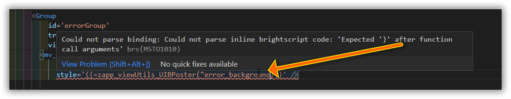

# Overview

Maestro is an MVVM (Model View View Model) framework. This pattern is, in the author's opinion, well suited to Roku development:

 - It allows us to decouple our view logic from the view
 - The resulting view models are highly testable
  - Which means we can write our code using TDD, with rapid turnover
  - While building a regression suite
  - And it's much faster to run a vm class's unit tests, than spin up the app and test our logic there
 - We can more easily stub and mock methods using this pattern
 - The boilerplate for observables, and other tasks is encapsulated into unit tested framework methods
 - Readers of our code have far more indication as to what code is business logic, and what code is pure view management

The framework base classes also have additional benefits
 - They provide a focus mechanism, making it easy to unit test focus management
 - They provide key listening hooks, making it easy to unit test keyboard interactions
 - They provide hooks for the Maestro view lifecycle methods, such as onShow, onFirstShow, onHide, etc

## Familiar pattern

This pattern is used in many frameworks such as :

 - Angular
 - Adobe flex
 - Xamarin Forms
 - WPF
 - etc

## Use in roku

Some studios/companies use this pattern, such as [plex](https://medium.com/plexlabs/xml-code-good-times-rsg-application-b963f0cec01b). Unfortunately, maestro is the only open source framework of this sort in the roku ecosystem at time of writing.

## Integration with vscode.

Maestro xml bindings are safe and easy to use! If you get them wrong, the compiler will fail, and you will get diagnostics in vscode while you type :)

